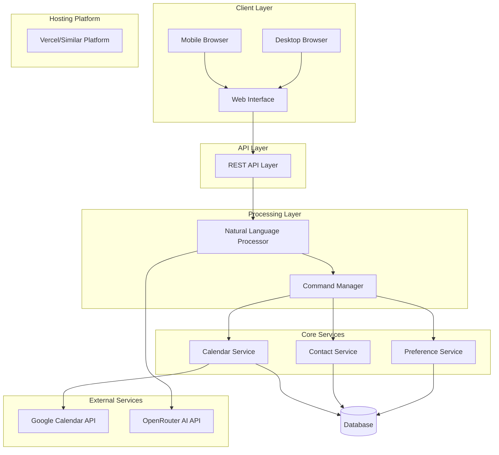

# Design Document

## Overview

The AI Calendar Assistant is a modular Node.js web application that provides natural language calendar management capabilities through integration with Google Calendar API and OpenRouter AI. The system is designed as a standalone module that can be integrated into a larger AI assistant ecosystem in the future.

The assistant enables users to manage their calendar through conversational commands, handles attendance priority categorization for family calendars, manages contacts for easy event creation, and provides intelligent scheduling suggestions based on historical patterns.

**Deployment Architecture**: The system is designed to be deployed as a web service on platforms like Vercel, with a REST API backend and web interface that works seamlessly on mobile devices through responsive design.

## Architecture

### High-Level Architecture



### Deployment Considerations

**Web Hosting Compatibility**:
- **Vercel Deployment**: Designed for serverless functions and static hosting
- **Mobile-First Design**: Responsive web interface optimized for mobile use
- **Progressive Web App (PWA)**: Can be installed on mobile devices for native-like experience
- **Database Options**: 
  - Development: SQLite for local development
  - Production: Vercel Postgres or similar cloud database for hosted deployment
- **Environment Variables**: Secure storage of API keys through platform environment variables

### Modular Design Principles

The system follows a modular architecture to support future integration:

- **Interface Abstraction**: All modules expose well-defined interfaces
- **Dependency Injection**: Services are injected rather than directly instantiated
- **Event-Driven Communication**: Modules communicate through events for loose coupling
- **Configuration Management**: Centralized configuration for easy integration
- **Standardized Data Models**: Common data structures across modules

## Components and Interfaces

### 1. Natural Language Processor (NLP)

**Purpose**: Processes user input using OpenRouter AI to extract intent and parameters

**Key Interfaces**:
```typescript
interface INLPService {
  parseCommand(input: string): Promise<ParsedCommand>
  generateClarification(context: CommandContext): Promise<string>
}

interface ParsedCommand {
  intent: CommandIntent
  parameters: CommandParameters
  confidence: number
  needsClarification: boolean
}
```

**Implementation Details**:
- Uses OpenRouter AI API with Bearer token authentication
- Implements retry logic with exponential backoff
- Caches common command patterns for performance
- Supports context-aware parsing for follow-up questions

### 2. Command Manager

**Purpose**: Routes parsed commands to appropriate services and orchestrates responses

**Key Interfaces**:
```typescript
interface ICommandManager {
  executeCommand(command: ParsedCommand): Promise<CommandResult>
  registerHandler(intent: CommandIntent, handler: CommandHandler): void
}

interface CommandHandler {
  handle(parameters: CommandParameters): Promise<CommandResult>
  validate(parameters: CommandParameters): ValidationResult
}
```

### 3. Calendar Service

**Purpose**: Manages Google Calendar integration and event operations

**Key Interfaces**:
```typescript
interface ICalendarService {
  createEvent(event: CalendarEvent): Promise<string>
  updateEvent(eventId: string, updates: Partial<CalendarEvent>): Promise<void>
  deleteEvent(eventId: string): Promise<void>
  getEvents(dateRange: DateRange): Promise<CalendarEvent[]>
  findOptimalTimes(requirements: SchedulingRequirements): Promise<TimeSlot[]>
}

interface CalendarEvent {
  id?: string
  title: string
  startTime: Date
  endTime: Date
  attendees: string[]
  attendancePriority: AttendancePriority
  description?: string
}
```

**Implementation Details**:
- Uses Google Calendar API v3 with OAuth2 authentication
- Implements automatic token refresh
- Supports batch operations for efficiency
- Handles rate limiting and error recovery

### 4. Contact Service

**Purpose**: Manages contact information for easy event invitations

**Key Interfaces**:
```typescript
interface IContactService {
  addContact(contact: Contact): Promise<string>
  updateContact(contactId: string, updates: Partial<Contact>): Promise<void>
  deleteContact(contactId: string): Promise<void>
  findContact(name: string): Promise<Contact[]>
  resolveContactEmail(name: string): Promise<string | null>
}

interface Contact {
  id?: string
  name: string
  email: string
  aliases?: string[]
  metadata?: Record<string, any>
}
```

### 5. Preference Service

**Purpose**: Manages user preferences and scheduling patterns

**Key Interfaces**:
```typescript
interface IPreferenceService {
  getUserPreferences(): Promise<UserPreferences>
  updatePreferences(updates: Partial<UserPreferences>): Promise<void>
  getSchedulingPatterns(): Promise<SchedulingPattern[]>
  analyzeSchedulingHistory(): Promise<SchedulingInsights>
}

interface UserPreferences {
  workingHours: TimeRange
  timeZone: string
  defaultMeetingDuration: number
  bufferTime: number
  attendancePriorityDefaults: AttendancePrioritySettings
}
```

## Data Models

### Core Data Types

```typescript
enum AttendancePriority {
  MUST_ATTEND = 'must_attend',
  SHOULD_ATTEND = 'should_attend',
  COULD_ATTEND = 'could_attend',
  WONT_ATTEND = 'wont_attend'
}

enum CommandIntent {
  CREATE_EVENT = 'create_event',
  UPDATE_EVENT = 'update_event',
  DELETE_EVENT = 'delete_event',
  QUERY_CALENDAR = 'query_calendar',
  FIND_TIME = 'find_time',
  MANAGE_CONTACT = 'manage_contact',
  UPDATE_PREFERENCES = 'update_preferences'
}

interface TimeSlot {
  startTime: Date
  endTime: Date
  confidence: number
  conflicts: ConflictInfo[]
}

interface SchedulingRequirements {
  duration: number
  participants: string[]
  preferredTimes?: TimeRange[]
  excludeConflicts: boolean
  attendancePriorityFilter?: AttendancePriority[]
}
```

### Database Schema

The system uses SQLite for local data storage with the following key tables:

```sql
-- Contacts table
CREATE TABLE contacts (
  id TEXT PRIMARY KEY,
  name TEXT NOT NULL,
  email TEXT NOT NULL,
  aliases TEXT, -- JSON array
  metadata TEXT, -- JSON object
  created_at DATETIME DEFAULT CURRENT_TIMESTAMP,
  updated_at DATETIME DEFAULT CURRENT_TIMESTAMP
);

-- User preferences table
CREATE TABLE user_preferences (
  key TEXT PRIMARY KEY,
  value TEXT NOT NULL, -- JSON value
  updated_at DATETIME DEFAULT CURRENT_TIMESTAMP
);

-- Calendar event cache (for performance and offline capability)
CREATE TABLE calendar_events_cache (
  id TEXT PRIMARY KEY,
  google_event_id TEXT UNIQUE,
  title TEXT NOT NULL,
  start_time DATETIME NOT NULL,
  end_time DATETIME NOT NULL,
  attendance_priority TEXT NOT NULL,
  attendees TEXT, -- JSON array
  description TEXT,
  last_synced DATETIME DEFAULT CURRENT_TIMESTAMP
);
```

## Error Handling

### Error Categories and Strategies

1. **API Errors**:
   - Google Calendar API: Retry with exponential backoff, handle rate limits
   - OpenRouter API: Fallback to cached responses, retry with different models

2. **Authentication Errors**:
   - Automatic token refresh for Google OAuth
   - Clear error messages for expired API keys

3. **Validation Errors**:
   - Input validation with clear error messages
   - Graceful handling of ambiguous natural language input

4. **Network Errors**:
   - Offline mode with cached data
   - Queue operations for retry when connection restored

### Error Response Format

```typescript
interface ErrorResponse {
  success: false
  error: {
    code: string
    message: string
    details?: any
    retryable: boolean
  }
}
```

## Testing Strategy

### Unit Testing
- **Coverage Target**: 90% code coverage
- **Framework**: Jest with TypeScript support
- **Mock Strategy**: Mock external APIs (Google Calendar, OpenRouter)
- **Test Categories**:
  - Service layer logic
  - Data model validation
  - Error handling scenarios
  - Natural language parsing accuracy

### Integration Testing
- **API Integration**: Test Google Calendar API integration with test calendar
- **Database Integration**: Test SQLite operations with in-memory database
- **End-to-End Flows**: Test complete user scenarios

### Performance Testing
- **Response Time**: Target <2 seconds for most operations
- **Concurrent Users**: Test handling of multiple simultaneous requests
- **Memory Usage**: Monitor memory consumption during extended use

### Test Data Management
- **Fixtures**: Standardized test data for consistent testing
- **Test Isolation**: Each test uses fresh database state
- **Mock Responses**: Realistic API response mocks

## Security Considerations

### Authentication & Authorization
- **Google OAuth2**: Secure token storage with encryption at rest
- **OpenRouter API Key**: Environment variable storage, never logged
- **Local Database**: SQLite with file-level encryption

### Data Privacy
- **Contact Data**: Local storage only, no cloud synchronization
- **Calendar Data**: Minimal caching with automatic cleanup
- **User Preferences**: Local storage with encryption

### API Security
- **Rate Limiting**: Implement client-side rate limiting
- **Input Validation**: Sanitize all user inputs
- **Error Handling**: No sensitive data in error messages

## Configuration Management

### Environment Configuration
```typescript
interface AppConfig {
  google: {
    clientId: string
    clientSecret: string
    redirectUri: string
  }
  openrouter: {
    apiKey: string
    baseUrl: string
    defaultModel: string
  }
  database: {
    path: string
    encryptionKey: string
  }
  server: {
    port: number
    host: string
  }
}
```

### Module Registration
```typescript
interface ModuleConfig {
  name: string
  version: string
  interfaces: string[]
  dependencies: string[]
  configSchema: JSONSchema
}
```

## Web Deployment & Mobile Access

### Hosting Platform Integration

**Vercel Deployment Strategy**:
- **API Routes**: Serverless functions for REST API endpoints (`/api/*`)
- **Static Assets**: Web interface served as static files
- **Environment Variables**: Secure API key storage through Vercel dashboard
- **Database**: Vercel Postgres for production, SQLite for development

**Mobile Access Design**:
- **Responsive Web Interface**: Mobile-first CSS design
- **Progressive Web App (PWA)**: 
  - Service worker for offline functionality
  - Web app manifest for "Add to Home Screen"
  - Push notifications for calendar reminders (future enhancement)
- **Touch-Optimized UI**: Large buttons, swipe gestures, voice input
- **Cross-Platform Compatibility**: Works on iOS Safari, Android Chrome, desktop browsers

### API Structure for Web Deployment

```typescript
// API Routes Structure
/api/auth/google          // Google OAuth flow
/api/calendar/events      // CRUD operations for events
/api/calendar/query       // Natural language queries
/api/contacts            // Contact management
/api/preferences         // User settings
/api/health              // Health check endpoint
```

### Future Integration Capabilities

**Modular Extension Points**:
- **Plugin Architecture**: New AI modules can register with the system
- **Webhook Support**: External systems can trigger calendar actions
- **API Gateway Ready**: Can be placed behind API gateway for larger system
- **Microservice Compatible**: Each service can be deployed independently

This modular design ensures the calendar assistant can be easily integrated into a larger AI assistant system while maintaining clean separation of concerns and well-defined interfaces. The web-first approach with mobile optimization provides immediate accessibility from any device while maintaining the flexibility for future native app development.